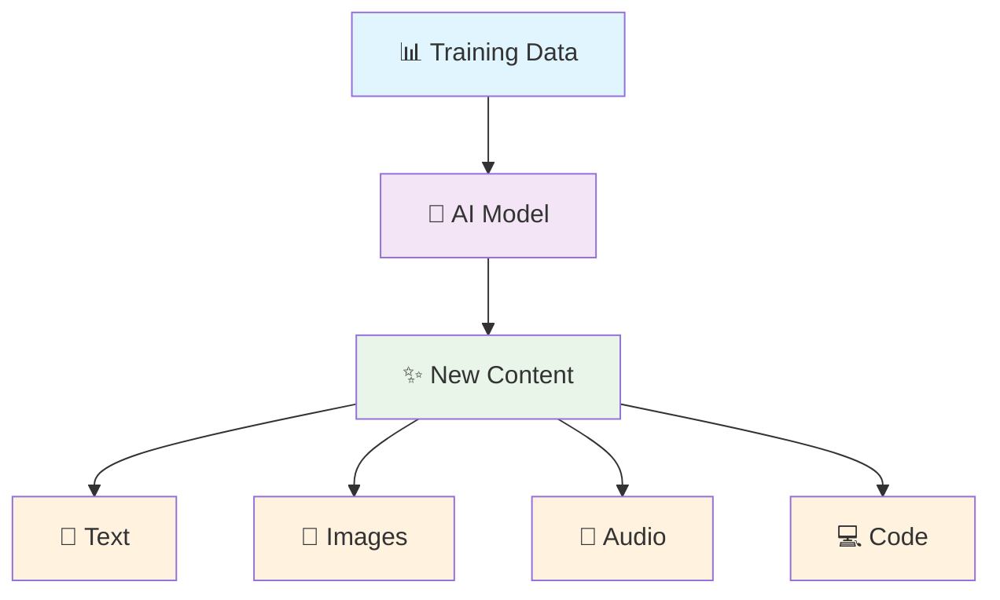
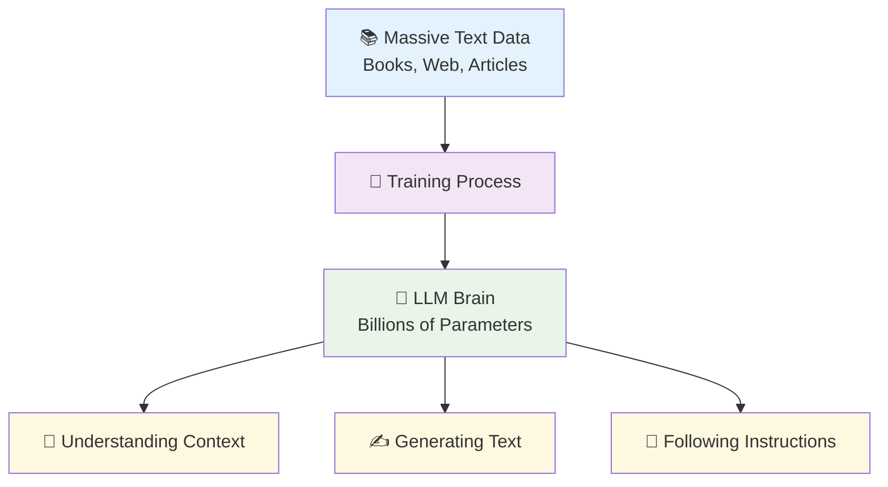
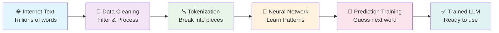
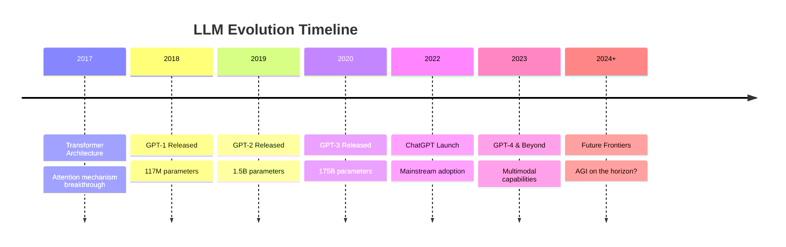
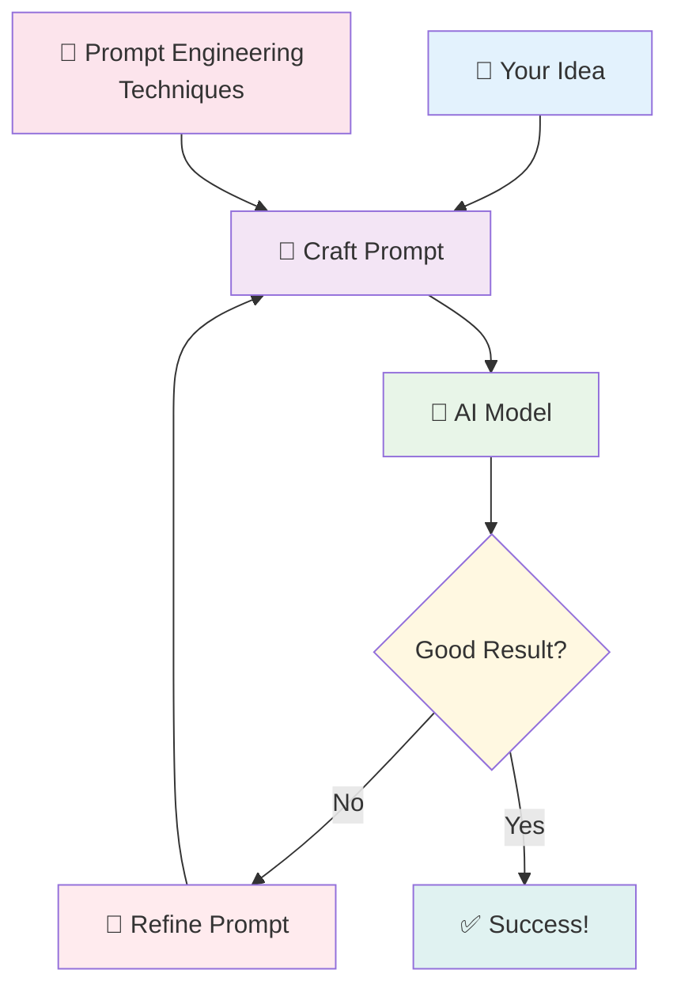

---

# 🧠 What is Generative AI?

<div class="grid grid-cols-2 gap-8">

<div>

## The Problem 🤔
- Humans need to create content manually
- Time-consuming creative processes
- Limited by individual expertise
- Repetitive tasks consume resources

## The Solution ✨
- AI that **generates** new content
- Learns patterns from existing data
- Creates human-like outputs
- Automates creative processes

</div>

<div>



</div>

</div>

---

# 🎯 Generative AI vs Traditional AI

<div class="grid grid-cols-2 gap-8">

<div class="bg-blue-50 p-6 rounded-lg">

## Traditional AI 🔍
- **Analyzes** existing data
- **Classifies** or **predicts**
- **Recognizes** patterns
- **Answers** questions

### Examples:
- 📧 Email spam detection
- 🏥 Medical diagnosis
- 📈 Stock price prediction
- 🚗 Autonomous driving

</div>

<div class="bg-green-50 p-6 rounded-lg">

## Generative AI ✨
- **Creates** new content
- **Generates** original outputs
- **Synthesizes** information
- **Produces** creative works

### Examples:
- ✍️ Writing articles
- 🎨 Creating artwork
- 💻 Writing code
- 🎵 Composing music

</div>

</div>

---

# 🌟 Real-World Generative AI Examples

<div class="grid grid-cols-2 gap-6">

<div class="space-y-4">

### 📝 Text Generation
- **ChatGPT**: Conversational AI assistant
- **GitHub Copilot**: Code completion
- **Copy.ai**: Marketing content creation

### 🎨 Image Generation
- **DALL-E**: Text-to-image creation
- **Midjourney**: Artistic image generation
- **Stable Diffusion**: Open-source image AI

</div>

<div class="space-y-4">

### 🎵 Audio & Music
- **AIVA**: AI music composer
- **Mubert**: Real-time music generation
- **Speechify**: Text-to-speech synthesis

### 🎬 Video & 3D
- **RunwayML**: Video editing & effects
- **Synthesia**: AI video avatars
- **NeRF**: 3D scene reconstruction

</div>

</div>

<div class="mt-8 text-center">
<span class="bg-yellow-100 px-4 py-2 rounded-full text-sm">
💡 These tools are transforming industries from entertainment to healthcare!
</span>
</div>

---

# ⚖️ Ethical Considerations

<div class="grid grid-cols-3 gap-6">

<div class="bg-red-50 p-4 rounded-lg text-center">
<div class="text-4xl mb-2">⚠️</div>
<h3>Challenges</h3>
<ul class="text-sm space-y-1">
<li>Deepfakes & misinformation</li>
<li>Copyright concerns</li>
<li>Job displacement fears</li>
<li>Bias in AI outputs</li>
</ul>
</div>

<div class="bg-blue-50 p-4 rounded-lg text-center">
<div class="text-4xl mb-2">🛡️</div>
<h3>Safeguards</h3>
<ul class="text-sm space-y-1">
<li>Content moderation</li>
<li>Watermarking systems</li>
<li>Ethical AI guidelines</li>
<li>Transparency requirements</li>
</ul>
</div>

<div class="bg-green-50 p-4 rounded-lg text-center">
<div class="text-4xl mb-2">🤝</div>
<h3>Best Practices</h3>
<ul class="text-sm space-y-1">
<li>Human oversight</li>
<li>Responsible disclosure</li>
<li>Inclusive training data</li>
<li>Continuous monitoring</li>
</ul>
</div>

</div>

<div class="mt-6 text-center bg-yellow-100 p-3 rounded-lg">
<strong>🎯 Goal:</strong> Harness AI's power while minimizing potential harm
</div>

---
layout: center
class: text-center
---

# 🔤 Large Language Models (LLMs)

<div class="text-6xl animate-pulse">🧠</div>

*The engines powering the AI revolution*

---

# 🤖 What are Large Language Models?

<div class="grid grid-cols-2 gap-8">

<div>

## Definition 📚
LLMs are AI models trained on vast amounts of text data to understand and generate human-like language.

## Key Characteristics 🔑
- **Large**: Billions/trillions of parameters
- **Language**: Focus on text understanding
- **Models**: Mathematical representations

## The Problem They Solve 🎯
- Computers couldn't understand context
- No natural language interaction
- Limited text generation capabilities

</div>

<div>



</div>

</div>

---

# 📊 How LLMs Work: The Training Process



<div class="mt-6 grid grid-cols-3 gap-4">

<div class="bg-blue-50 p-3 rounded text-center">
<strong>📥 Input:</strong><br/>
"The cat sat on the ___"
</div>

<div class="bg-purple-50 p-3 rounded text-center">
<strong>🧠 Processing:</strong><br/>
Analyze context & patterns
</div>

<div class="bg-green-50 p-3 rounded text-center">
<strong>📤 Output:</strong><br/>
"mat" (87% confidence)
</div>

</div>

---


# 🚀 LLM Capabilities & Potential

<div class="grid grid-cols-2 gap-6">

<div>

### 💪 Current Capabilities
- **Text Generation**: Articles, stories, emails
- **Translation**: 100+ languages
- **Summarization**: Long documents → key points
- **Q&A**: Answer complex questions
- **Code Generation**: Multiple programming languages
- **Creative Writing**: Poetry, scripts, ideas

</div>

<div>

### 🔮 Future Potential
- **Multimodal**: Text + Images + Audio
- **Reasoning**: Complex problem solving
- **Personalization**: Adapt to individual users
- **Real-time Learning**: Update knowledge continuously
- **Specialized Domains**: Medicine, law, science
- **Interactive Agents**: Autonomous AI assistants

</div>

</div>

---

<div class="mt-6">



</div>

---

# 🎯 Popular LLMs Comparison

<div class="grid grid-cols-3 gap-4">

<div class="bg-green-50 p-4 rounded-lg">
<h3 class="text-center">🤖 OpenAI GPT</h3>
<ul class="text-sm space-y-1">
<li><strong>GPT-4:</strong> Most capable</li>
<li><strong>GPT-3.5:</strong> Fast & efficient</li>
<li><strong>Strengths:</strong> Reasoning, creativity</li>
<li><strong>Use case:</strong> General purpose</li>
</ul>
</div>

<div class="bg-blue-50 p-4 rounded-lg">
<h3 class="text-center">🧠 Google Gemini</h3>
<ul class="text-sm space-y-1">
<li><strong>Bard:</strong> Conversational AI</li>
<li><strong>PaLM 2:</strong> Technical tasks</li>
<li><strong>Strengths:</strong> Real-time data</li>
<li><strong>Use case:</strong> Search integration</li>
</ul>
</div>

<div class="bg-purple-50 p-4 rounded-lg">
<h3 class="text-center">🦙 Meta LLaMA</h3>
<ul class="text-sm space-y-1">
<li><strong>LLaMA 2:</strong> Open source</li>
<li><strong>Code Llama:</strong> Programming</li>
<li><strong>Strengths:</strong> Customizable</li>
<li><strong>Use case:</strong> Research & development</li>
</ul>
</div>

</div>

<div class="mt-6 grid grid-cols-2 gap-4">

<div class="bg-orange-50 p-4 rounded-lg">
<h3 class="text-center">⚡ Claude (Anthropic)</h3>
<p class="text-sm">Constitutional AI, safety-focused, long conversations</p>
</div>

<div class="bg-red-50 p-4 rounded-lg">
<h3 class="text-center">🚀 Open Source Models</h3>
<p class="text-sm">Mistral, Falcon, Alpaca - Community-driven innovation</p>
</div>

</div>

---
layout: center
class: text-center
---

# 💬 Prompt Engineering

<div class="text-6xl animate-bounce">🎯</div>

*The art of talking to AI*

---

# 🎨 What is Prompt Engineering?

<div class="grid grid-cols-2 gap-8">

<div>

## Definition 📝
The practice of crafting effective inputs (prompts) to get desired outputs from AI models.

## Why It Matters 🎯
- **Quality**: Better prompts = better results
- **Efficiency**: Save time and tokens
- **Control**: Guide AI behavior precisely
- **Consistency**: Reproducible outcomes

## The Challenge 🤔
- AI doesn't read minds
- Context is crucial
- Ambiguity leads to confusion

</div>

</div>

---
layout: center
class: text-center
---



---

# 🔧 Basic Prompt Engineering Techniques

<div class="grid grid-cols-2 gap-6">

<div>

### 1. 🎯 Be Specific & Clear
**Bad:** "Write about dogs"
**Good:** "Write a 200-word blog post about the benefits of adopting rescue dogs, targeting first-time pet owners"

### 2. 📋 Provide Context
**Bad:** "Translate this"
**Good:** "Translate this business email from English to French, maintaining a professional tone"

### 3. 🎭 Define the Role
**Bad:** "Help me with code"
**Good:** "Act as a senior Python developer and help me optimize this data processing function"

</div>

<div>

### 4. 📖 Use Examples
**Bad:** "Format this data"
**Good:** "Format this data like this example:
Input: John, 25, Engineer
Output: Name: John | Age: 25 | Job: Engineer"

### 5. 🎚️ Control Output Format
**Bad:** "Explain machine learning"
**Good:** "Explain machine learning in exactly 3 bullet points, each under 50 words"

### 6. 🔄 Iterate & Refine
- Start simple, add details
- Test different approaches
- Learn from what works

</div>

</div>

---

# 🛠️ Advanced Prompting Strategies

<div class="space-y-6">

<div class="grid grid-cols-2 gap-6">

<div class="bg-blue-50 p-4 rounded-lg">
<h3>🧠 Chain of Thought (CoT)</h3>
<p class="text-sm mb-2">Ask AI to think step-by-step</p>
<div class="bg-white p-2 rounded text-xs">
<strong>Prompt:</strong> "Solve this math problem step by step: If a train travels 120 km in 2 hours..."
</div>
</div>

<div class="bg-green-50 p-4 rounded-lg">
<h3>🎭 Role-Playing</h3>
<p class="text-sm mb-2">Give AI a specific persona</p>
<div class="bg-white p-2 rounded text-xs">
<strong>Prompt:</strong> "You are a patient teacher explaining quantum physics to a 10-year-old..."
</div>
</div>

</div>

<div class="grid grid-cols-2 gap-6">

<div class="bg-purple-50 p-4 rounded-lg">
<h3>📋 Few-Shot Learning</h3>
<p class="text-sm mb-2">Provide multiple examples</p>
<div class="bg-white p-2 rounded text-xs">
<strong>Prompt:</strong> "Classify sentiment:<br/>
'I love this!' → Positive<br/>
'This is terrible' → Negative<br/>
'It's okay' → ?"
</div>
</div>

<div class="bg-orange-50 p-4 rounded-lg">
<h3>🔍 Prompt Chaining</h3>
<p class="text-sm mb-2">Break complex tasks into steps</p>
<div class="bg-white p-2 rounded text-xs">
<strong>Step 1:</strong> "Summarize this article"<br/>
<strong>Step 2:</strong> "Now create 5 tweets from that summary"
</div>
</div>

</div>

</div>

---

# 📊 Prompt Engineering Best Practices

<div class="grid grid-cols-3 gap-4">

<div class="bg-green-50 p-4 rounded-lg">
<h3 class="text-center">✅ Do's</h3>
<ul class="text-sm space-y-1">
<li>🎯 Be specific and clear</li>
<li>📋 Provide context</li>
<li>🔢 Use examples when helpful</li>
<li>🎚️ Specify output format</li>
<li>🧪 Experiment and iterate</li>
<li>🔍 Break down complex tasks</li>
</ul>
</div>

<div class="bg-red-50 p-4 rounded-lg">
<h3 class="text-center">❌ Don'ts</h3>
<ul class="text-sm space-y-1">
<li>🚫 Don't be vague or ambiguous</li>
<li>🚫 Don't assume AI knows context</li>
<li>🚫 Don't make prompts too long</li>
<li>🚫 Don't ignore the first attempt</li>
<li>🚫 Don't forget to proofread</li>
<li>🚫 Don't expect perfection first try</li>
</ul>
</div>

<div class="bg-blue-50 p-4 rounded-lg">
<h3 class="text-center">💡 Tips</h3>
<ul class="text-sm space-y-1">
<li>🎨 Start with a template</li>
<li>📝 Keep a prompt library</li>
<li>🔄 Use A/B testing</li>
<li>📊 Measure success metrics</li>
<li>🤝 Learn from community</li>
<li>⚡ Consider token limits</li>
</ul>
</div>

</div>

<div class="mt-6 text-center bg-yellow-100 p-3 rounded-lg">
<strong>🎯 Remember:</strong> Great prompting is part art, part science. Practice makes perfect!
</div>

---

# 🚀 Hands-On Prompt Examples

<div class="grid grid-cols-2 gap-6">

<div class="space-y-4">

### 📧 Email Writing
```
Write a professional follow-up email to a job interview.

Context:
- Interview was yesterday
- Position: Software Developer
- Company: TechCorp
- Interviewer: Sarah Johnson
- Express gratitude and reiterate interest

Tone: Professional but warm
Length: Under 150 words
```

### 📊 Data Analysis
```
Act as a data analyst. Analyze this sales data 
and provide insights:

[Data would go here]

Please provide:
1. Key trends (3 bullet points)
2. Top performing product
3. Recommendation for next quarter
4. Present findings clearly for executives
```

</div>

<div class="space-y-4">

### 🎨 Creative Writing
```
Write a short story (300 words) with these elements:
- Setting: Space station in 2150
- Character: Rookie engineer named Alex
- Conflict: Power system failure
- Theme: Problem-solving under pressure
- Tone: Suspenseful but optimistic
- End with a clever solution
```

### 💻 Code Generation
```
Create a Python function that:
1. Takes a list of numbers as input
2. Removes duplicates
3. Sorts in ascending order
4. Returns the result

Requirements:
- Include docstring
- Add error handling
- Use type hints
- Provide usage example
```

</div>

</div>

---