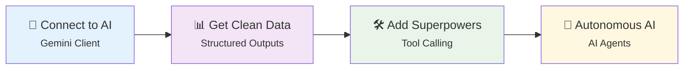
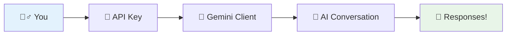
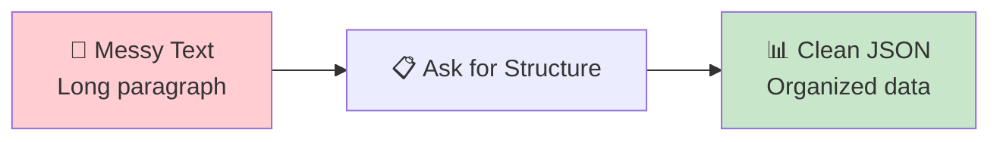
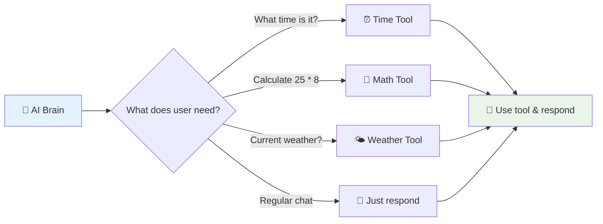
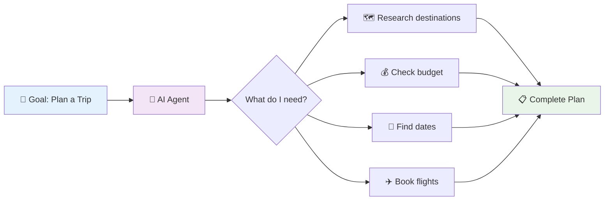
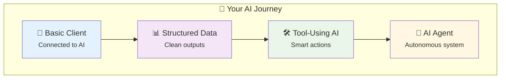

# Part 2: 🛠️ Building with LLMs – Tools & Agents

**45 minutes of hands-on building**

---

# 📚 What We'll Build Today



<div class="mt-6 text-center">
<div class="p-4 bg-blue-100 rounded-lg">
🎯 <strong>From simple API calls to smart AI agents in 45 minutes!</strong>
</div>
</div>

---

# 🔌 Using the LLM Client



## 🚀 Your First Connection

[001-use-llm-client.ipynb](https://colab.research.google.com/drive/1B3-ZgX3jZpr0U4LKHouwjw2AHq2lwTMh?usp=sharing)

---

# 🎮 Making It Interactive

[002-making-it-interactive.ipynb](https://colab.research.google.com/drive/136JQOyiI0rHvjGH4HiVctBQXCZNkLS6W?usp=sharing)


<div class="grid grid-cols-2 gap-6 mt-6">

<div class="p-4 bg-blue-50 rounded-lg">
<strong>💡 What Just Happened?</strong>
<ul class="text-sm mt-2">
<li>🔌 Connected to Google's AI</li>
<li>💬 Sent messages back and forth</li>
<li>🎯 Got intelligent responses</li>
</ul>
</div>

<div class="p-4 bg-yellow-50 rounded-lg">
<strong>🎯 Try Asking:</strong>
<ul class="text-sm mt-2">
<li>Tell me about Pokhara</li>
<li>Explain how to make a cake</li>
<li>Help me plan a birthday party</li>
</ul>
</div>

</div>

---

# 📊 Structured Outputs



## 🤔 The Problem

<div class="grid grid-cols-2 gap-6">

<div class="p-4 bg-red-50 rounded-lg">
<strong>😵 Messy Output:</strong>
<div class="text-sm mt-2 bg-white p-2 rounded">
न्युरोड भाटभटेनी निर अन्तर्राष्ट्रिय कपडा तथा जुत्ता शोरूमको लागि कम्प्युटरमा बेसिक ज्ञान भएको स्मार्ट र गुड लूकिङ् SALE GIRL आवश्यकता। अनुभव पर्दैन। समय 10am 8pm, महिनामा 2 दिन बिदा। तलब 12000+</div>
</div>

<div class="p-4 bg-green-50 rounded-lg">
<strong>✨ Clean Output:</strong>
<div class="text-sm mt-2 bg-white p-2 rounded">
```json
{
    "job": "Sale Girl",
    "required_skills": "Computer Basic",
    "experience": "No Experience",
    "location": "Newroad Bhatbhateni",
    "salary": "12000+",
    "office_type": "Clothing Store",
    "working_time": "10am 8pm",
    "holidays": "2 days",
}
```
</div>
</div>

</div>

---

# 📊 Getting Structured Data

```python
from pydantic import BaseModel

# 👨🏼‍💻 Define the structure of the output type
class JobPosting(BaseModel):
    job: str
    gender: str | None
    required_skills: str
    experience: str
    location: str
    salary: str
    office_type: str
    working_time: str
    holidays: str
```

[003-structured-outputs.ipynb](https://colab.research.google.com/drive/1RyIQYoYnpnXSraAMBl6MMfMEL3L0yyrh?usp=sharing)


<div class="mt-4 p-3 bg-purple-100 rounded">
🎯 <strong>Pro Tip:</strong> Be very specific about the format you want!
</div>

---

# 🛠️ Tool Calling



[004-tool-calling.ipynb](https://drive.google.com/file/d/1_VSXsuixPu0gtCzMqfiuG6G0MwMSLASF/view?usp=sharing)

---

# 🤖 AI Agents



## 🧠 What Makes an AI Agent?

<div class="grid grid-cols-3 gap-4">

<div class="text-center p-3 bg-blue-100 rounded">
<strong>🎯 Goals</strong><br>
<small>Knows what to achieve</small>
</div>

<div class="text-center p-3 bg-purple-100 rounded">
<strong>🧠 Reasoning</strong><br>
<small>Thinks through steps</small>
</div>

<div class="text-center p-3 bg-green-100 rounded">
<strong>🛠️ Actions</strong><br>
<small>Uses tools to get things done</small>
</div>

</div>

---

# 🌟 What You've Built in this Part



<div class="grid grid-cols-2 gap-6 mt-6">

<div class="p-4 bg-green-100 rounded-lg">
<strong>✅ What You Can Do Now:</strong>
<ul class="text-sm mt-2">
<li>🔌 Connect to any LLM API</li>
<li>📊 Get structured, usable data</li>
<li>🛠️ Give AI real-world capabilities</li>
<li>🤖 Build thinking, acting AI agents</li>
</ul>
</div>

<div class="p-4 bg-blue-100 rounded-lg">
<strong>🚀 Next Steps:</strong>
<ul class="text-sm mt-2">
<li>🎯 Add more tools to your agent</li>
<li>📱 Build a web interface</li>
<li>🔗 Connect to real APIs</li>
<li>🌟 Create specialized AI assistants</li>
</ul>
</div>

</div>

---

# 🎯 Your Next Steps

<div class="p-6 bg-yellow-50 rounded-lg">

**🎮 Challenge: Build a Personal Assistant Agent**

Create an AI agent that can:
1. 💬 Chat naturally with users
2. ⏰ Tell the current time when asked
3. 🧮 Solve math problems
4. 📊 Return information in clean JSON format

**⏱️ Time: 5 minutes**  
**🎯 Goal: Combine everything you learned today!**

</div>

<div class="mt-4 text-center">
<div class="p-3 bg-purple-100 rounded-lg">
🌟 <strong>Congratulations! You're now an AI builder!</strong>
</div>
</div>

---