# Part 3: 🔍 Retrieval Augmented Generation (RAG)
## Making AI Smart About YOUR Data

---

# 📋 What We'll Learn Today

<div class="grid grid-cols-1 gap-6 text-left">

<div class="p-6 bg-blue-100 rounded-lg">
<h3>🤔 <strong>The Need for RAG</strong></h3>
<p>Why regular AI can't help with your specific data</p>
</div>

<div class="p-6 bg-green-100 rounded-lg">
<h3>🏗️ <strong>RAG Architecture</strong></h3>
<p>How the magic pipeline works: load → chunk → embed → retrieve → generate</p>
</div>

<div class="p-6 bg-orange-100 rounded-lg">
<h3>🛠️ <strong>Practical RAG Demo</strong></h3>
<p>See it in action with real GCES documents</p>
</div>

</div>

---
layout: section
---

# 🤔 The Need for RAG
## Why Regular AI Falls Short

---

# 🤖 The Problem with Regular AI

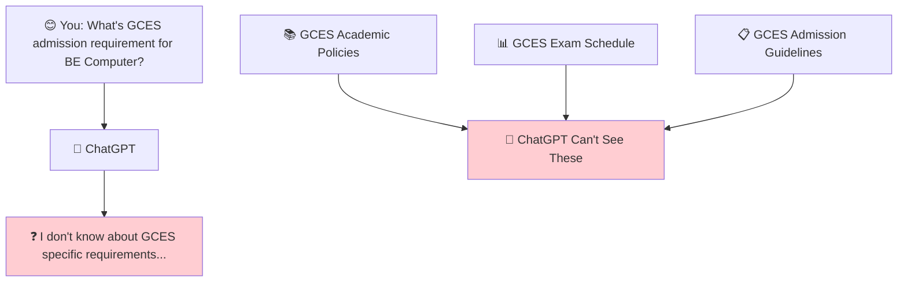

<div class="text-center mt-6">
<div class="p-4 bg-red-100 rounded-lg">
😔 <strong>Problem: AI only knows what it was trained on, not YOUR college data!</strong>
</div>
</div>

---

# 📊 Real GCES Student Examples

<div class="grid grid-cols-2 gap-8">

<div>

### ❌ What AI CAN'T Do
```
😊 "What's GCES minimum CGPA requirement?"
🤖 "I don't know GCES specific policies..."

😊 "When is the next semester exam?"
🤖 "I don't have access to GCES exam schedule..."

😊 "What labs are available for BE Computer?"
🤖 "I can't see GCES facility information..."

😊 "How do I apply for GCES scholarship?"
🤖 "I don't know GCES scholarship procedures..."
```

</div>

<div>

### ✅ What We NEED
```
😊 "What's GCES minimum CGPA requirement?"
🤖 "According to GCES policy, you need 
    2.0 CGPA for undergraduate programs..."

😊 "When is the next semester exam?"
🤖 "Based on GCES academic calendar, 
    Spring 2025 exams start in March..."

😊 "What labs are available for BE Computer?"
🤖 "GCES has Computer labs, Electronics labs,
    and Microprocessor labs for students..."

😊 "How do I apply for GCES scholarship?"
🤖 "GCES offers merit-based scholarships.
    Apply through scholarship committee..."
```

</div>

</div>

---

# 💡 The Solution: RAG

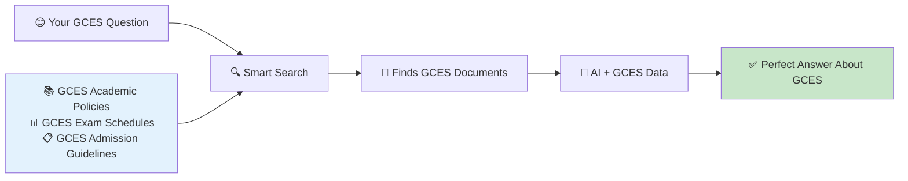

<div class="text-center mt-6">
<div class="p-4 bg-green-100 rounded-lg">
🎉 <strong>RAG = Give AI access to GCES data = AI that actually helps students!</strong>
</div>
</div>

---
layout: section
---

# 🏗️ RAG Architecture
## The 5-Step Magic Pipeline

---

# 🔄 The Complete RAG Pipeline

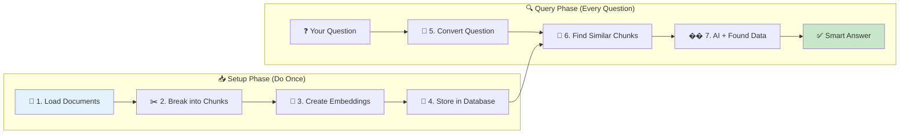

---

# 📄 Step 1: Document Loading

<div class="grid grid-cols-2 gap-8">

<div>

### 📚 What GCES Documents?
```
📋 Academic Policies
  ├── GCES-Admission-Guidelines.pdf
  ├── Exam-Rules-Regulations.docx
  └── Academic-Calendar-2025.pdf

📊 Program Information  
  ├── BE-Computer-Curriculum.md
  ├── BE-Software-Syllabus.pdf
  └── Lab-Facility-Guide.docx

📈 Student Services
  ├── Scholarship-Policy.pdf
  ├── Library-Access-Guide.docx
  └── Transportation-Schedule.md
```

</div>

<div>

### 🎯 The Goal
<div class="p-4 bg-blue-100 rounded-lg mb-4">
<strong>Turn your scattered GCES documents into AI-readable format</strong>
</div>

```
Before: 📄📄📄 (Separate files)
After:  📚 (One searchable GCES knowledge base)
```

<div class="mt-4 p-3 bg-green-100 rounded">
💡 <strong>Like organizing GCES library - everything in one searchable place!</strong>
</div>

</div>

</div>

---

# ✂️ Step 2: Chunking (Breaking Documents Apart)

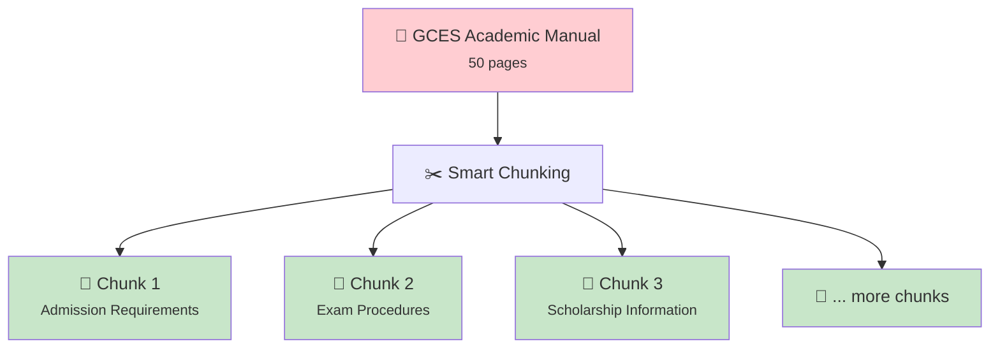

---

# 📝 Step 2: Chunking (Breaking Documents Apart)

<div class="grid grid-cols-2 gap-8 mt-6">

<div>

### 🤔 Why Break Apart?
- 🧠 AI works better with smaller pieces
- 🎯 More precise search results  
- ⚡ Faster processing
- 💡 Better context matching

</div>

<div>

### 📝 Example: GCES Academic Policy
```
Original: 50-page GCES academic manual

Chunk 1: "BE Computer requires 48 seats, minimum C grade in SLC..."
Chunk 2: "GCES provides transportation with 45-passenger bus..."  
Chunk 3: "Computer labs equipped with proprietary and open-source software..."
Chunk 4: "Scholarships awarded to academically bright students..."
```

</div>

</div>

---

# 🔢 Step 3: Embeddings (Text → Numbers)

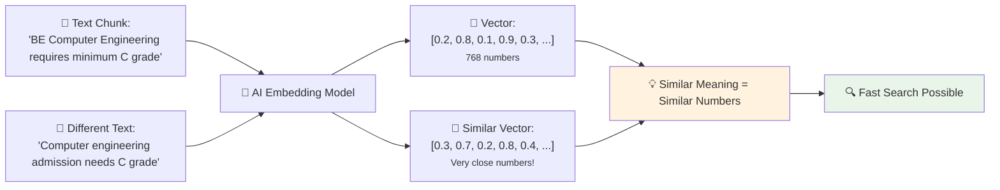

<div class="text-center mt-4">
<div class="p-3 bg-blue-100 rounded">
🌟 <strong>Like GPS coordinates for words - similar GCES terms cluster together!</strong>
</div>
</div>

---

# 🔗 Understanding Embeddings

<div class="grid grid-cols-2 gap-8">

<div>

## What are Embeddings? 🤔
Mathematical representations of words/concepts as numbers (vectors) that capture meaning and relationships.

## The Magic ✨
- Similar words have similar vectors
- Relationships are preserved mathematically
- Enable semantic understanding

## Example Relationships 📐
- King - Man + Woman = Queen
- Paris - France + Italy = Rome

</div>

<div>

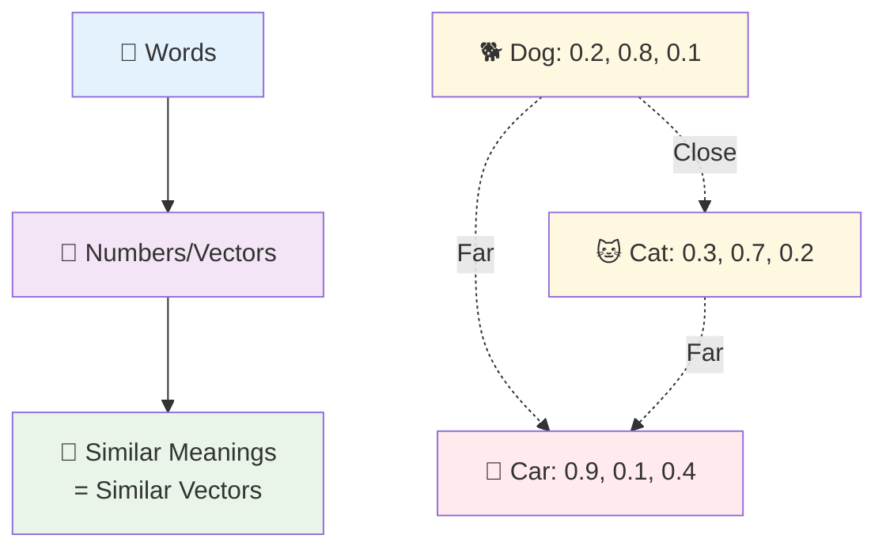

</div>

</div>

<div class="mt-4 text-center bg-blue-100 p-3 rounded-lg">
💡 <strong>Think of embeddings as a GPS for words in meaning-space!</strong>
</div>

---

# 💾 Step 4: Storage in Vector Database

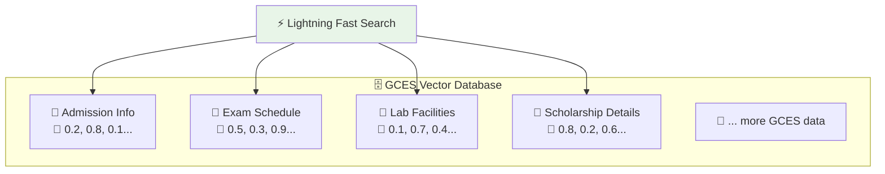

<div class="grid grid-cols-2 gap-6 mt-6">

<div class="p-4 bg-green-100 rounded">
<strong>✅ What's Special?</strong>
<ul>
<li>🔍 Search by meaning, not just keywords</li>
<li>⚡ Super fast (milliseconds)</li>
<li>🎯 Finds relevant GCES content automatically</li>
<li>📊 Handles all GCES documents</li>
</ul>
</div>

<div class="p-4 bg-blue-100 rounded">
<strong>🌟 Real GCES Examples</strong>
<ul>
<li>"admission requirement" finds "entrance criteria"</li>
<li>"scholarship" finds "financial assistance"</li>
<li>"exam schedule" finds "assessment calendar"</li>
<li>"lab access" finds "laboratory facilities"</li>
</ul>
</div>

</div>

---

# 🔍 Step 5: Smart Retrieval

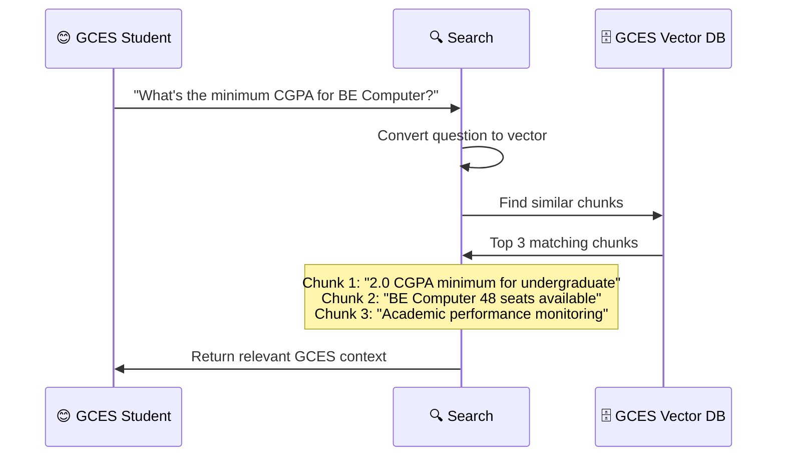

<div class="text-center mt-6">
<div class="p-4 bg-orange-100 rounded-lg">
🎯 <strong>Smart search finds the BEST matching GCES content, not just keyword matches!</strong>
</div>
</div>

---

# 🤖 Step 6: AI Generation with Context

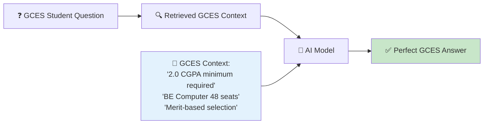

---

# 🔍 Step 6: AI Generation with Context

### 💬 The Magic Prompt

**System:** You are a helpful GCES academic assistant.

**Context from GCES documents:**
- "BE Computer Engineering requires minimum 2.0 CGPA"  
- "GCES offers 48 seats for BE Computer program"
- "Selection is merit-based through entrance examination"

**Student Question:** "What's the minimum CGPA for BE Computer at GCES?"

**Your Answer:** Based on GCES academic policy, you need a minimum 2.0 CGPA for the BE Computer Engineering program. The program has 48 seats and selection is merit-based through entrance examination!

---
layout: section
---

# 🛠️ Practical RAG Demo
## See It Work with Real GCES Documents

---

# 📚 Demo Setup: GCES Knowledge Base

<div class="grid grid-cols-2 gap-8">

<div>

### 📄 Sample GCES Documents
```
📋 GCES-Academic-Policy.pdf
"BE Computer and BE Software each have 48 seats. 
Minimum C grade in SLC Science required. 
Entrance exam based on Math (40%), Physics (30%), 
Chemistry (20%), English (10%). Fee is NPR 822,600."

🛠️ GCES-Facilities.pdf  
"Computer labs equipped with proprietary and 
open-source software. Electronics lab, 
Microprocessor lab available. Library has 
computerized system and e-books. 45-passenger 
bus for transportation."

💰 GCES-Scholarship.pdf
"Merit-based scholarships for academically bright 
students. Entrance exam toppers get scholarships. 
Semester toppers awarded according to college 
rules. Financial assistance for needy students."
```

</div>

<div>

### 🎯 Demo Questions
```
❓ "How many seats in BE Computer?"

❓ "What's the GCES admission fee?"

❓ "What labs are available?"

❓ "How do I get GCES scholarship?"

❓ "What's the entrance exam pattern?"

❓ "Does GCES provide transportation?"
```

<div class="mt-4 p-3 bg-green-100 rounded">
🎉 <strong>Watch RAG find perfect answers from GCES documents!</strong>
</div>

</div>

</div>

---

# 🔍 Demo: Question → Answer Journey

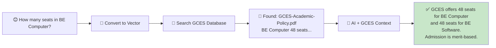

<div class="grid grid-cols-2 gap-6 mt-6">

<div class="p-4 bg-blue-100 rounded">
<strong>🔍 What Happened?</strong>
<ul>
<li>Question converted to numbers</li>
<li>Database searched for similar GCES content</li>
<li>Found seat information in academic policy</li>
<li>AI combined GCES context with question</li>
<li>Generated helpful, accurate GCES answer</li>
</ul>
</div>

<div class="p-4 bg-green-100 rounded">
<strong>✨ Why It's Amazing</strong>
<ul>
<li>No manual searching through GCES files</li>
<li>Instant, accurate GCES answers</li>
<li>Cites actual GCES policies</li>
<li>Works with any GCES document type</li>
<li>Scales to all GCES information</li>
</ul>
</div>

</div>

---

# 🎮 Live Demo Results

<div class="grid grid-cols-1 gap-6">

<div class="p-4 bg-green-100 rounded">
<strong>😊 Q: "How many seats in BE Computer?"</strong><br/>
🤖 <strong>A:</strong> "GCES offers 48 seats for BE Computer Engineering and 48 seats for BE Software Engineering. Both programs are affiliated with Pokhara University!"
</div>

<div class="p-4 bg-blue-100 rounded">
<strong>😊 Q: "What's the GCES admission fee?"</strong><br/>
🤖 <strong>A:</strong> "The fee for both BE Computer and BE Software at GCES is NPR 822,600. This covers your entire undergraduate program!"
</div>

</div>

---

# 🎮 Live Demo Results

<div class="grid grid-cols-1 gap-6">

<div class="p-4 bg-orange-100 rounded">
<strong>😊 Q: "What labs are available at GCES?"</strong><br/>
🤖 <strong>A:</strong> "GCES has excellent facilities including Computer labs with proprietary and open-source software, Electronics and Microprocessor labs, and Physics labs - all aligned with curriculum requirements!"
</div>

<div class="p-4 bg-purple-100 rounded">
<strong>😊 Q: "How do I get GCES scholarship?"</strong><br/>
🤖 <strong>A:</strong> "GCES offers merit-based scholarships! Entrance exam toppers and semester toppers get scholarships. They also provide financial assistance for academically bright but needy students."
</div>

</div>

---

# 🚀 Real-World RAG Applications

<div class="grid grid-cols-2 gap-8">

<div>

### 🏢 Educational Use Cases
```
📚 Student Information System
- Academic policies, exam schedules, admission
- "What's the minimum attendance requirement?"

🛒 Campus Support
- Lab bookings, library access, facilities  
- "How do I book the computer lab?"

📖 Academic Assistant
- Course materials, syllabus, assignments
- "What's covered in Data Structures?"

🏥 Campus Services
- Health center, transportation, cafeteria
- "What time does the campus bus leave?"
```

</div>

<div>

### 💡 Why RAG Wins for Students
```
✅ Always Up-to-Date
   Your college docs = Your answers

✅ College-Specific  
   Knows YOUR policies & procedures

✅ Saves Time
   No manual document searching

✅ Scales Infinitely
   Works with all college documents

✅ Cost Effective
   One system, multiple use cases

✅ Easy to Maintain
   Add new docs = Instant knowledge
```

</div>

</div>

---

# 🏆 What You've Learned in this Part

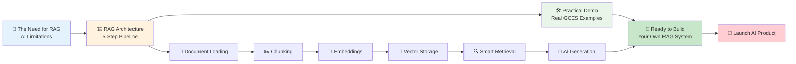

<div class="text-center mt-6">
<div class="p-4 bg-green-100 rounded-lg">
🎉 <strong>You now understand how to make AI smart about YOUR college data!</strong>
</div>
</div>

---