# Part 4: 🚀 Your Next Steps
## From Workshop to Real Projects

---

# 💡 Project Ideas to Start Today

```mermaid
mindmap
  root((🚀 Your AI Projects))
    🏠 Personal
      📖 Personal Knowledge Assistant
      📧 Email Writer
      📅 Smart Calendar
      🎵 Music Recommender
    💼 Professional  
      📊 Data Analyzer
      📝 Report Generator
      🎯 Lead Qualifier
      📞 Meeting Summarizer
    🌍 Community
      🏥 Health Q&A Bot
      📚 Study Buddy
      🛒 Shopping Assistant
      🎮 Game Companion
```



---

# 🛠️ Easy First Projects

<div class="grid grid-cols-2 gap-8">

<div class="p-4 bg-green-50 rounded-lg border-2 border-green-200">
<h3>📖 Personal Knowledge Assistant</h3>

<strong>What it does:</strong> Ask questions about your own documents  
<strong>Time to build:</strong> 2 hours  
<strong>You'll need:</strong>
- Your notes/documents
- RAG system we built
- Simple web interface

```python
# Just extend what we built!
add_documents(your_personal_notes)
answer = professional_rag("What did I learn about Python?")
```
</div>

<div class="p-4 bg-blue-50 rounded-lg border-2 border-blue-200">
<h3>💌 Smart Email Assistant</h3>

<strong>What it does:</strong> Write emails in your style  
<strong>Time to build:</strong> 1 hour  
<strong>You'll need:</strong>
- Email examples
- Style prompts
- Simple interface

```python
def write_email(recipient, topic, tone="professional"):
    prompt = f"Write a {tone} email to {recipient} about {topic}"
    return model.generate_content(prompt).text
```
</div>

</div>

---

# 🎯 Your Learning Roadmap

```mermaid
graph TB
    A[🎓 Today: Workshop Complete] --> B[📅 Week 1-2: Build First Project]
    B --> C[📅 Week 3-4: Learn Web Interfaces]
    C --> D[📅 Month 2: Advanced Features]
    D --> E[📅 Month 3: Deploy & Share]
    E --> F[🏆 AI Developer]
    
    B1[📖 Personal Assistant] --> B
    B2[💌 Email Helper] --> B
    
    C1[🌐 Streamlit] --> C
    C2[⚡ FastAPI] --> C
    
    D1[🗄️ Better Databases] --> D
    D2[🔐 User Authentication] --> D
    D3[📊 Analytics] --> D
    
    E1[☁️ Cloud Hosting] --> E
    E2[📱 Mobile App] --> E
    
    style F fill:#ffd700
```



---

# 📚 Essential Resources for Continued Learning

<div class="grid grid-cols-2 gap-8">

<div>

### 🎥 <strong>Free Learning</strong>
- <strong>YouTube</strong>: "AI Jason" for practical tutorials
- <strong>Coursera</strong>: Google AI courses (audit for free)
- <strong>freeCodeCamp</strong>: AI/ML track
- <strong>GitHub</strong>: Copy and modify real projects

### 📖 <strong>Documentation</strong>
- <strong>OpenAI Docs</strong>: Clear examples
- <strong>LangChain</strong>: Framework for AI apps
- <strong>Streamlit</strong>: Easy web interfaces
- <strong>Google Colab</strong>: Free coding environment

</div>

<div>

### 💡 <strong>Practice Platforms</strong>
- <strong>Kaggle</strong>: Real datasets and competitions
- <strong>Hugging Face</strong>: Free AI models to try
- <strong>Replit</strong>: Code in browser, share easily
- <strong>GitHub Codespaces</strong>: Free development environment

### 🤝 <strong>Communities</strong>
- <strong>Reddit</strong>: r/MachineLearning, r/OpenAI
- <strong>Discord</strong>: AI developer communities
- <strong>Twitter</strong>: Follow AI builders and researchers
- <strong>Local Meetups</strong>: Find AI groups near you

</div>

</div>

---

# ⚡ Quick Start: Your First App This Weekend

```mermaid
graph LR
    A[🛠️ Choose Simple Project] --> B[💻 Set Up Environment]
    B --> C[🔨 Build Core Features] 
    C --> D[🎨 Add Simple UI]
    D --> E[🚀 Share & Get Feedback]
    
    style A fill:#fff3e0
    style E fill:#e8f5e8
```



<div class="grid grid-cols-3 gap-4 mt-6">

<div class="p-4 bg-yellow-100 rounded text-center">
<strong>Saturday Morning</strong><br/>
🛠️ Set up project<br/>
📝 Plan features<br/>
🔍 Gather data
</div>

<div class="p-4 bg-orange-100 rounded text-center">
<strong>Saturday Afternoon</strong><br/>
💻 Write core code<br/>
🧪 Test basic functions<br/>
🐛 Fix initial bugs
</div>

<div class="p-4 bg-green-100 rounded text-center">
<strong>Sunday</strong><br/>
🎨 Add user interface<br/>
📱 Test with friends<br/>
🚀 Deploy and share!
</div>

</div>

---

# 🎯 Success Tips for New AI Builders

<div class="grid grid-cols-2 gap-8">

<div>

### ✅ <strong>Do This</strong>
- <strong>Start small</strong> - Build working prototypes first
- <strong>Copy examples</strong> - Learn by modifying existing code  
- <strong>Share early</strong> - Get feedback from real users
- <strong>Document everything</strong> - You'll forget how it works
- <strong>Join communities</strong> - Learn from other builders
- <strong>Stay curious</strong> - Try new models and techniques

</div>

<div>

### ❌ <strong>Avoid This</strong>
- <strong>Perfectionism</strong> - Done is better than perfect
- <strong>Complex first projects</strong> - Start simple, add features later
- <strong>Working alone</strong> - Community accelerates learning
- <strong>Ignoring costs</strong> - Monitor API usage and expenses
- <strong>Chasing trends</strong> - Focus on solving real problems
- <strong>Giving up quickly</strong> - Every expert was once a beginner

</div>

</div>

<div class="mt-6 p-4 bg-gradient-to-r from-blue-100 to-purple-100 rounded-lg text-center">
🌟 <strong>Remember: Every AI expert started exactly where you are right now!</strong>
</div>

---

# 🏆 Your AI Builder Journey Starts Now

```mermaid
graph LR
    A[🎓 You Today<br/>Workshop Graduate] --> B{Choose Your Path}
    
    B --> C[💼 Career Changer<br/>Land AI Job]
    B --> D[🚀 Entrepreneur<br/>Build AI Startup]  
    B --> E[🛠️ Side Projects<br/>Automate Life]
    B --> F[🎓 Student<br/>Deeper Learning]
    
    C --> G[💻 Apply AI Skills at Work]
    D --> H[🌟 Launch AI Product]
    E --> I[⚡ Save Time & Money]
    F --> J[🧠 Become AI Expert]
    
    G --> K[🏅 AI Success Story]
    H --> K
    I --> K
    J --> K
    
    style A fill:#e3f2fd
    style K fill:#c8e6c9
```



---

# 🎉 You're Ready!

<div class="text-center">

<div class="text-6xl mb-6">🚀</div>

<h2 class="text-3xl mb-6">From ChatGPT User to AI Builder</h2>

<div class="grid grid-cols-4 gap-4 mb-8">

<div class="p-4 bg-green-100 rounded">
✅ <strong>API Mastery</strong><br>
<small>Connect to any AI</small>
</div>

<div class="p-4 bg-blue-100 rounded">
✅ <strong>Smart Prompts</strong><br>
<small>Get exactly what you want</small>
</div>

<div class="p-4 bg-purple-100 rounded">
✅ <strong>Tool Integration</strong><br>
<small>AI with superpowers</small>
</div>

<div class="p-4 bg-yellow-100 rounded">
✅ <strong>Smart Search</strong><br>
<small>AI that knows your data</small>
</div>

</div>

<div class="p-6 bg-gradient-to-r from-green-200 to-blue-200 rounded-lg">
<div class="text-2xl mb-4">🎯 <strong>Your Mission</strong></div>
<div class="text-lg">Pick one project. Start this weekend. Build something amazing! 🌟</div>
</div>

</div>

---
layout: center
class: text-center
---

# 🙏 Thank You!

## You're Now an AI Builder!

<div class="text-2xl mt-8 mb-6">
🔥 Ready to change the world with AI? 🔥
</div>

<div class="grid grid-cols-3 gap-6 mt-8">

<div class="p-4 bg-blue-100 rounded">
<strong>💬 Questions?</strong><br>
Let's discuss your ideas!
</div>

<div class="p-4 bg-green-100 rounded">
<strong>🤝 Connect</strong><br>
Share your projects with us!
</div>

<div class="p-4 bg-purple-100 rounded">
<strong>🚀 Build</strong><br>
Start your first AI app today!
</div>

</div>

<div class="mt-8 text-lg opacity-75">
The best time to plant a tree was 20 years ago.<br>
The second best time is now. 🌱
</div>
---