---
# You can also start simply with 'default'
theme: seriph
# random image from a curated Unsplash collection by Anthony
# like them? see https://unsplash.com/collections/94734566/slidev
background: https://images.unsplash.com/photo-1451187580459-43490279c0fa?ixlib=rb-4.0.3&ixid=M3wxMjA3fDB8MHxwaG90by1wYWdlfHx8fGVufDB8fHx8fA%3D%3D&auto=format&fit=crop&w=2072&q=80
# some information about your slides (markdown enabled)
title: Generative AI Workshop for Beginners
info: |
  ## Generative AI Workshop for Beginners
  From ChatGPT user to AI Builder
class: text-center
# apply unocss classes to the current slide
drawings:
  persist: false
# slide transition: https://sli.dev/guide/animations.html#slide-transitions
transition: slide-left
# enable MDC Syntax: https://sli.dev/features/mdc
mdc: true
---

# 🤖 AI Workshop for Beginners
## From ChatGPT User to AI Builder

<div class="text-xl mt-8">
🎯 **Perfect for you if you:**
</div>

<div class="grid grid-cols-2 gap-8 mt-6">
<div>

✅ Use ChatGPT regularly  
✅ Want to build your own AI apps  
✅ Learn by doing, not theory  
✅ Ready to get hands dirty with code  

</div>
<div>

🚀 **You'll learn to:**  
📱 Build AI chatbots  
🔍 Create smart search tools  
⚡ Automate tasks with AI  
🛠️ Use real AI APIs  

</div>
</div>

---

# 🗺️ Your Learning Journey Today

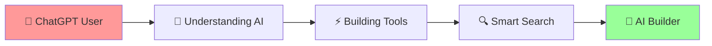

<div class="grid grid-cols-4 gap-4 mt-8">

<div class="text-center p-4 bg-blue-100 rounded">
**Part 1** 🧠<br>
AI Basics<br>
<small>15 min</small>
</div>

<div class="text-center p-4 bg-green-100 rounded">
**Part 2** ⚡<br>
Building Tools<br>
<small>30 min</small>
</div>

<div class="text-center p-4 bg-yellow-100 rounded">
**Part 3** 🔍<br>
Smart Search<br>
<small>30 min</small>
</div>

<div class="text-center p-4 bg-purple-100 rounded">
**Part 4** 🚀<br>
Your Project<br>
<small>15 min</small>
</div>

</div>

---
layout: section
---

# Part 1: 🧠 AI Basics
## What's Really Happening Behind ChatGPT?

---

# 🤔 When You Chat with ChatGPT...

```mermaid
graph TD
    A[😊 You: "Write me a poem"] --> B[🤖 ChatGPT Brain]
    B --> C[📝 Beautiful Poem]
    
    B1[📚 Reads millions of books] --> B
    B2[🧮 Learns patterns] --> B
    B3[🎯 Predicts next word] --> B
    
    style A fill:#e1f5fe
    style B fill:#fff3e0
    style C fill:#e8f5e8
```

<div class="mt-6 p-4 bg-blue-50 rounded-lg">
💡 **Think of ChatGPT like a super-smart autocomplete** that's read the entire internet!
</div>

---

# 🎯 What Makes AI "Generative"?

<div class="grid grid-cols-2 gap-8">

<div>

## 🔍 Traditional Search
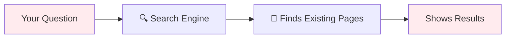

**Example:** "Python tutorial"  
**Result:** Links to existing tutorials

</div>

<div>

## ✨ Generative AI
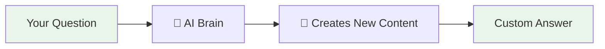

**Example:** "Python tutorial"  
**Result:** Creates a custom tutorial just for you!

</div>

</div>

---

# 🧩 AI Can Create Anything!

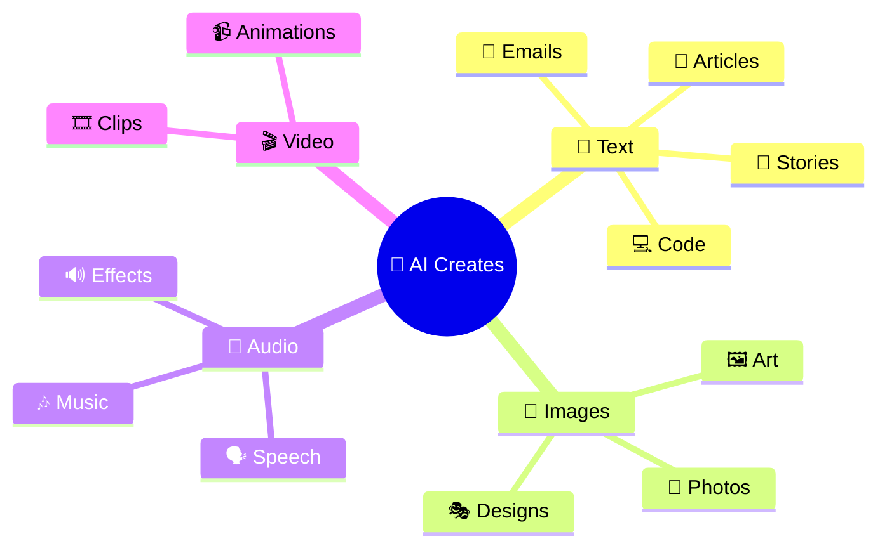

<div class="text-center mt-6 p-4 bg-gradient-to-r from-blue-100 to-purple-100 rounded-lg">
🎉 **You're already using this magic every day with ChatGPT!**
</div>

---

# 💡 Why Should You Care?

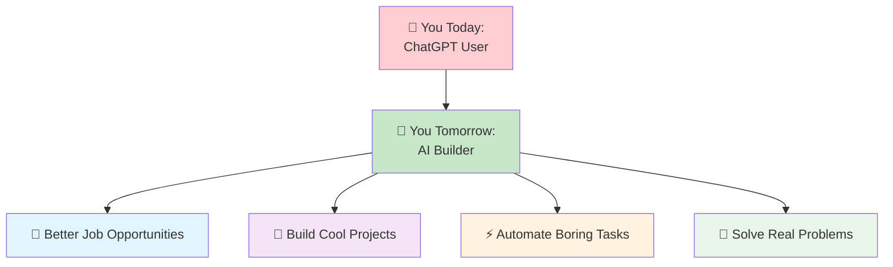

---

# 🎭 Meet Different AI Personalities

<div class="grid grid-cols-3 gap-6">

<div class="text-center p-4 border-2 border-blue-200 rounded-lg">
<div class="text-4xl mb-2">🤖</div>
<strong>ChatGPT</strong><br>
<small>The Conversationalist</small><br>
💬 Great at chatting<br>
📝 Writes anything<br>
🧠 Explains concepts
</div>

<div class="text-center p-4 border-2 border-green-200 rounded-lg">
<div class="text-4xl mb-2">🎨</div>
<strong>DALL-E</strong><br>
<small>The Artist</small><br>
🖼️ Creates images<br>
🎭 Any style you want<br>
✨ From text descriptions
</div>

<div class="text-center p-4 border-2 border-purple-200 rounded-lg">
<div class="text-4xl mb-2">👨‍💻</div>
<strong>GitHub Copilot</strong><br>
<small>The Programmer</small><br>
💻 Writes code<br>
🐛 Fixes bugs<br>
📚 Explains code
</div>

</div>

<div class="mt-6 text-center">
<div class="p-4 bg-yellow-100 rounded-lg">
🎯 **Today we'll learn to build our own AI personalities!**
</div>
</div>

---

# 🔮 Your AI Future Starts Here

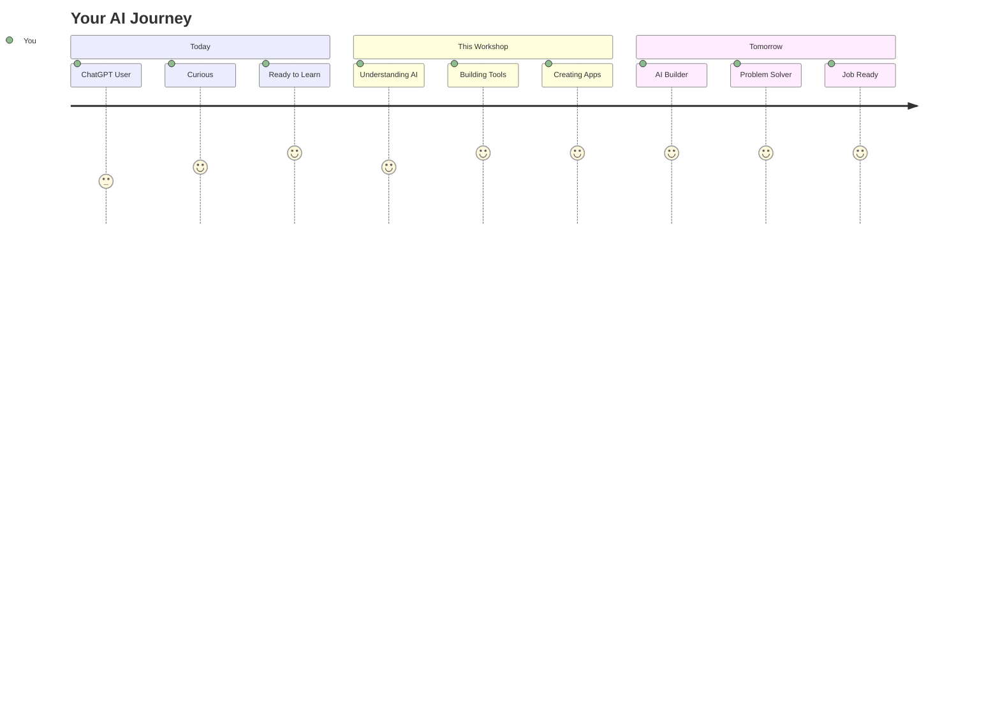

<div class="mt-6 p-4 bg-gradient-to-r from-green-100 to-blue-100 rounded-lg text-center">
🚀 **Ready to go from user to builder? Let's start coding!**
</div>

---
layout: section
---

# Part 2: ⚡ Building Your First AI Tool
## From Zero to AI Builder in 30 Minutes

---

# 🛠️ Your First AI Toolbox

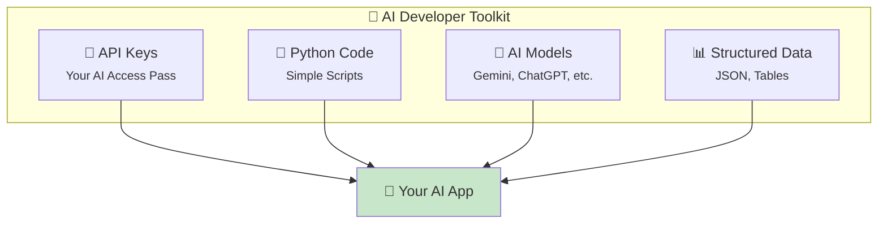

<div class="mt-6 text-center">
<div class="p-4 bg-blue-100 rounded-lg">
💡 **Think of APIs like ordering food: You ask, AI delivers!**
</div>
</div>

---

# 🔑 Getting Your AI Superpowers (API Keys)

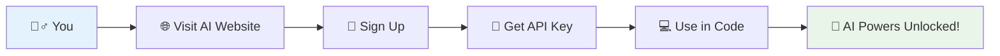

<div class="grid grid-cols-2 gap-8 mt-6">

<div class="p-4 bg-green-50 rounded-lg">
<strong>🎯 Popular AI Services</strong>
<ul>
<li>🟢 <strong>Google Gemini</strong> - Free tier available</li>
<li>🟦 <strong>OpenAI</strong> - $5 credit to start</li>
<li>🟣 <strong>Anthropic Claude</strong> - Pay per use</li>
</ul>
</div>

<div class="p-4 bg-yellow-50 rounded-lg">
<strong>⚡ Quick Setup</strong>
<ol>
<li>Go to ai.google.dev</li>
<li>Click "Get API Key"</li>
<li>Copy your key</li>
<li>Start building!</li>
</ol>
</div>

</div>

---

# 💬 Your First AI Conversation (Code)

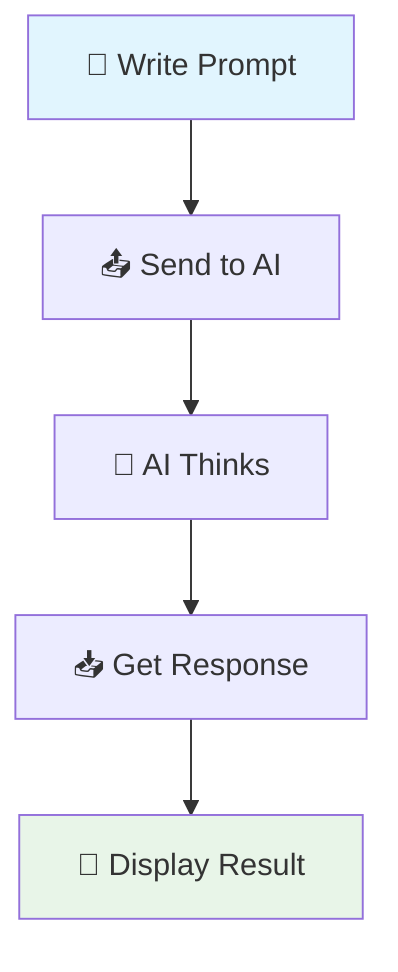

## 🐍 Super Simple Python Code

```python
import google.generativeai as genai

# 🔑 Connect to AI (like logging into ChatGPT)
genai.configure(api_key="YOUR_API_KEY")
model = genai.GenerativeModel('gemini-pro')

# 💬 Have a conversation
response = model.generate_content("Write a funny joke about programming")
print(response.text)
```

<div class="mt-4 p-3 bg-green-100 rounded">
🎯 **That's it! You just built your first AI app in 4 lines of code!**
</div>

---

# 🎮 Let's Make It Interactive!

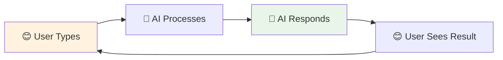

```python
# 🎮 Interactive AI Chat
def chat_with_ai():
    print("🤖 Hi! I'm your personal AI assistant!")
    
    while True:
        # 👤 Get user input
        user_question = input("\n😊 You: ")
        
        if user_question.lower() == 'bye':
            print("🤖 Goodbye! 👋")
            break
            
        # 🤖 Get AI response
        response = model.generate_content(user_question)
        print(f"🤖 AI: {response.text}")

# 🚀 Start chatting!
chat_with_ai()
```

<div class="mt-4 p-3 bg-blue-100 rounded">
🎉 **Congratulations! You just built a mini-ChatGPT!**
</div>

---

# 📊 Making AI Give You Organized Data

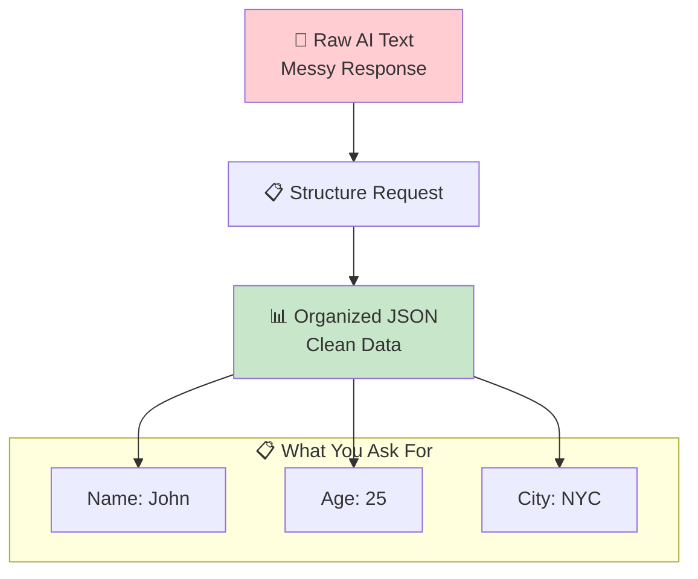

---

# 📊 Structured Data Example

**🔴 Messy Response:**
```
John is a 25 year old person who lives in New York City and works as a software engineer
```

**🟢 Structured Response:**
```json
{
  "name": "John",
  "age": 25,
  "city": "New York City",
  "job": "Software Engineer"
}
```

```python
# 📊 Ask AI for structured data
prompt = """
Extract person info from: "John is a 25 year old software engineer in NYC"

Return as JSON:
{
  "name": "...",
  "age": ...,
  "city": "...",
  "job": "..."
}
"""

response = model.generate_content(prompt)
print(response.text)  # Gets clean JSON!
```

---

# 🛠️ Giving AI Superpowers with Tools

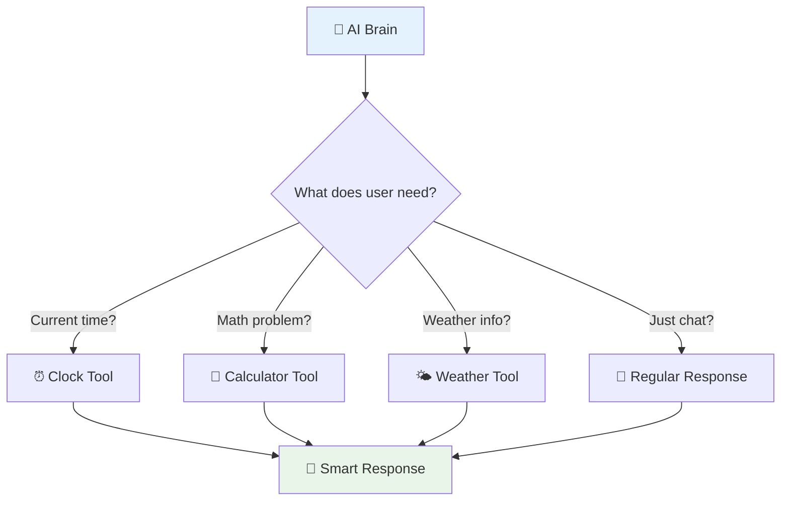

---

# 🛠️ Building Your First AI Tool

```python
# 🧮 Calculator Tool
def calculate(expression):
    """Smart calculator that AI can use"""
    try:
        result = eval(expression)  # Simple math
        return f"Result: {result}"
    except:
        return "Oops! That's not valid math"

# ⏰ Time Tool  
def get_current_time():
    """Get current time"""
    from datetime import datetime
    return f"Current time: {datetime.now().strftime('%H:%M')}"

# 🧰 Tool Box
tools = {
    "calculator": calculate,
    "time": get_current_time
}

# 🤖 Smart AI that uses tools
def smart_ai_chat(user_message):
    if "time" in user_message.lower():
        return get_current_time()
    elif any(char in user_message for char in "+-*/"):
        # Extract math expression and calculate
        return calculate(user_message)
    else:
        # Regular AI response
        return model.generate_content(user_message).text
```

---

# 🎯 Your AI Assistant in Action

```mermaid
graph TD
    A[😊 User: "What's 25 * 4?"] --> B[🤖 AI Detects Math]
    B --> C[🧮 Uses Calculator Tool]
    C --> D[📊 Returns: 100]
    
    E[😊 User: "What time is it?"] --> F[🤖 AI Detects Time Request]
    F --> G[⏰ Uses Time Tool]
    G --> H[📊 Returns: 14:30]
    
    I[😊 User: "Tell me a joke"] --> J[🤖 AI Detects Chat]
    J --> K[💬 Uses Language Skills]
    K --> L[😂 Returns: Funny Joke]
    
    style D fill:#c8e6c9
    style H fill:#c8e6c9
    style L fill:#c8e6c9
```

<div class="text-center mt-6">
<div class="p-4 bg-purple-100 rounded-lg">
🎉 **You just built an AI that can think and use tools!**
</div>
</div>

---

# 🚀 What You've Built So Far

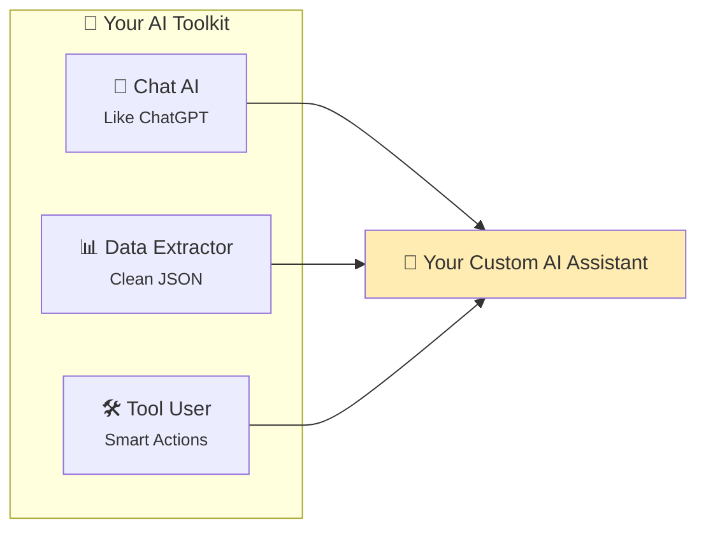

<div class="grid grid-cols-3 gap-4 mt-6">

<div class="text-center p-3 bg-green-100 rounded">
✅ **API Connection**<br>
<small>Talk to AI models</small>
</div>

<div class="text-center p-3 bg-blue-100 rounded">
✅ **Smart Prompts**<br>
<small>Get what you want</small>
</div>

<div class="text-center p-3 bg-purple-100 rounded">
✅ **Tool Integration**<br>
<small>AI with superpowers</small>
</div>

</div>

---
layout: section
---

# Part 3: 🔍 Building Smart Search
## RAG: When AI Meets Your Data

---

# 🤔 The Problem with Regular AI

```mermaid
graph TD
    A[😊 You: "What's our company's vacation policy?"] --> B[🤖 ChatGPT]
    B --> C[❓ "I don't know about your specific company..."]
    
    D[📚 Your Company Docs] --> E[🚫 ChatGPT Can't See These]
    
    style C fill:#ffcdd2
    style E fill:#ffcdd2
```

<div class="text-center mt-6">
<div class="p-4 bg-red-100 rounded-lg">
😔 **Problem: AI only knows what it was trained on, not YOUR data!**
</div>
</div>

---

# 💡 The Solution: RAG (Smart Search + AI)

```mermaid
graph TD
    A[😊 You: "What's our vacation policy?"] --> B[🔍 Smart Search]
    B --> C[📄 Finds Relevant Docs]
    C --> D[🤖 AI + Your Docs]
    D --> E[✅ "Your company gives 20 days vacation..."]
    
    F[📚 Your Documents] --> B
    
    style E fill:#c8e6c9
    style F fill:#e3f2fd
```

<div class="text-center mt-6">
<div class="p-4 bg-green-100 rounded-lg">
🎉 **RAG = Retrieval + AI Generation = Smart AI that knows YOUR stuff!**
</div>
</div>

---

# 🧠 How RAG Works (Simple Version)

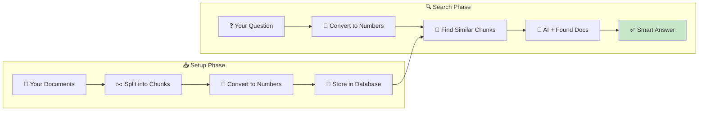

---

# 📊 Real Example: Company Knowledge Base

<div class="grid grid-cols-2 gap-8">

<div>

### 📄 Your Documents
```
📋 HR Policy.pdf
- Vacation: 20 days/year
- Sick leave: 10 days/year
- Remote work: 3 days/week

🛠️ Tech Guide.pdf  
- API endpoint: /api/v1/users
- Database: PostgreSQL
- Deploy with: Docker

💰 Benefits.pdf
- Health insurance: Covered 100%
- Dental: $50/month
- 401k: 5% match
```

</div>

<div>

### 🔍 Smart Search Results
```python
# User asks: "How many vacation days?"

# 1. Search finds: "Vacation: 20 days/year"
# 2. AI gets context + question
# 3. AI responds:

"Based on your HR policy, you get 
20 vacation days per year. These 
reset annually and can be taken 
with manager approval."
```

<div class="mt-4 p-3 bg-green-100 rounded">
🎯 **AI now knows YOUR company data!**
</div>

</div>

</div>

---

# 🔢 The Magic: Converting Text to Numbers

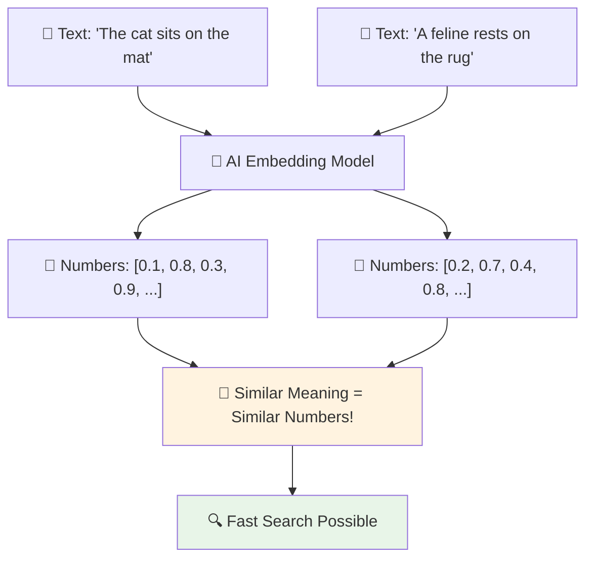

<div class="text-center mt-4">
<div class="p-3 bg-blue-100 rounded">
💡 **Like GPS coordinates for words - similar meanings cluster together!**
</div>
</div>

---

# 🛠️ Building Your First Smart Search

```python
# 📚 Simple Document Store
documents = [
    "Our office is open Monday to Friday 9 AM to 6 PM",
    "Vacation requests need 2 weeks notice and manager approval", 
    "We use Slack for team communication and Zoom for meetings",
    "Health insurance covers 100% of medical costs",
    "Remote work is allowed 3 days per week maximum"
]

# 🔍 Simple Search Function
def simple_search(question, docs):
    """Find the most relevant document"""
    question_words = question.lower().split()
    
    best_doc = ""
    best_score = 0
    
    for doc in docs:
        # Count matching words
        doc_words = doc.lower().split()
        score = sum(1 for word in question_words if word in doc_words)
        
        if score > best_score:
            best_score = score
            best_doc = doc
    
    return best_doc

# 🎯 Test it!
question = "What are the office hours?"
relevant_doc = simple_search(question, documents)
print(f"Found: {relevant_doc}")
```

---

# ⚡ Enhanced RAG with AI

```python
def smart_rag_answer(question):
    # 🔍 Step 1: Find relevant documents
    relevant_docs = simple_search(question, documents)
    
    # 🤖 Step 2: Ask AI with context
    prompt = f"""
    Based on this company information:
    {relevant_docs}
    
    Answer this question: {question}
    
    Keep it friendly and helpful!
    """
    
    # ✨ Step 3: Get smart answer
    response = model.generate_content(prompt)
    return response.text

# 🎮 Try it out!
questions = [
    "What are the office hours?",
    "How do I request vacation?", 
    "What communication tools do we use?"
]

for q in questions:
    print(f"❓ Q: {q}")
    print(f"🤖 A: {smart_rag_answer(q)}")
    print("-" * 50)
```

---

# 📈 Professional RAG with Vector Search

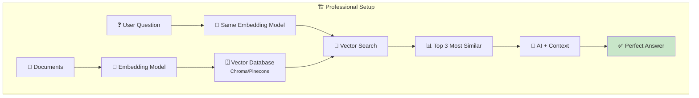

```python
# 🚀 Professional RAG System
import chromadb
from sentence_transformers import SentenceTransformer

# 🧠 Setup embedding model
embedder = SentenceTransformer('all-MiniLM-L6-v2')

# 🗄️ Setup vector database
client = chromadb.Client()
collection = client.create_collection("company_docs")

# 📊 Add documents with embeddings
def add_documents(docs):
    embeddings = embedder.encode(docs)
    collection.add(
        documents=docs,
        embeddings=embeddings.tolist(),
        ids=[f"doc_{i}" for i in range(len(docs))]
    )

# 🔍 Smart search function
def professional_rag(question):
    # Get question embedding
    question_embedding = embedder.encode([question])
    
    # Search similar documents
    results = collection.query(
        query_embeddings=question_embedding.tolist(),
        n_results=2
    )
    
    # Build context and ask AI
    context = "\n".join(results['documents'][0])
    prompt = f"Context: {context}\n\nQuestion: {question}\nAnswer:"
    
    return model.generate_content(prompt).text
```

---

# 🎯 Your RAG System in Action

```mermaid
sequenceDiagram
    participant U as 😊 User
    participant S as 🔍 Search System
    participant DB as 🗄️ Vector DB
    participant AI as 🤖 AI Model
    
    U->>S: "How many vacation days?"
    S->>DB: Convert question to vectors
    DB->>S: Return similar documents
    S->>AI: Question + Found documents
    AI->>S: Generate smart answer
    S->>U: "20 days per year with manager approval"
    
    Note over U,AI: All happens in seconds!
```

<div class="grid grid-cols-2 gap-6 mt-6">

<div class="p-4 bg-green-100 rounded">
<strong>✅ What You Built</strong>
<ul>
<li>🔍 Smart document search</li>
<li>🤖 AI that knows your data</li>
<li>⚡ Lightning fast responses</li>
<li>🎯 Always relevant answers</li>
</ul>
</div>

<div class="p-4 bg-blue-100 rounded">
<strong>🚀 Use Cases</strong>
<ul>
<li>📚 Company knowledge base</li>
<li>🏥 Medical Q&A system</li>
<li>📖 Educational assistant</li>
<li>💼 Customer support bot</li>
</ul>
</div>

</div>

---

# 🏆 What You've Accomplished!

```mermaid
graph TD
    A[👶 Beginner<br/>ChatGPT User] --> B[🎓 Workshop Graduate]
    
    B --> C[💬 Can Build AI Chatbots]
    B --> D[🛠️ Can Add AI Tools]
    B --> E[🔍 Can Create Smart Search]
    B --> F[📊 Can Structure AI Data]
    
    C --> G[🚀 Ready to Build Real Apps]
    D --> H[🌟 Launch AI Product]
    E --> I[⚡ Save Time & Money]
    F --> J[🧠 Become AI Expert]
    
    G --> K[🏅 AI Success Story]
    H --> K
    I --> K
    J --> K
    
    style A fill:#e3f2fd
    style B fill:#fff3e0
    style K fill:#c8e6c9
```

---
layout: section
---

# Part 4: 🚀 Your Next Steps
## From Workshop to Real Projects

---

# 💡 Project Ideas to Start Today

```mermaid
mindmap
  root((🚀 Your AI Projects))
    🏠 Personal
      📖 Personal Knowledge Assistant
      📧 Email Writer
      📅 Smart Calendar
      🎵 Music Recommender
    💼 Professional  
      📊 Data Analyzer
      📝 Report Generator
      🎯 Lead Qualifier
      📞 Meeting Summarizer
    🌍 Community
      🏥 Health Q&A Bot
      📚 Study Buddy
      🛒 Shopping Assistant
      🎮 Game Companion
```

---

# 🛠️ Easy First Projects

<div class="grid grid-cols-2 gap-8">

<div class="p-4 bg-green-50 rounded-lg border-2 border-green-200">
<h3>📖 Personal Knowledge Assistant</h3>

**What it does:** Ask questions about your own documents  
**Time to build:** 2 hours  
**You'll need:**
- Your notes/documents
- RAG system we built
- Simple web interface

```python
# Just extend what we built!
add_documents(your_personal_notes)
answer = professional_rag("What did I learn about Python?")
```
</div>

<div class="p-4 bg-blue-50 rounded-lg border-2 border-blue-200">
<h3>💌 Smart Email Assistant</h3>

**What it does:** Write emails in your style  
**Time to build:** 1 hour  
**You'll need:**
- Email examples
- Style prompts
- Simple interface

```python
def write_email(recipient, topic, tone="professional"):
    prompt = f"Write a {tone} email to {recipient} about {topic}"
    return model.generate_content(prompt).text
```
</div>

</div>

---

# 🎯 Your Learning Roadmap

```mermaid
graph TB
    A[🎓 Today: Workshop Complete] --> B[📅 Week 1-2: Build First Project]
    B --> C[📅 Week 3-4: Learn Web Interfaces]
    C --> D[📅 Month 2: Advanced Features]
    D --> E[📅 Month 3: Deploy & Share]
    E --> F[🏆 AI Developer]
    
    B1[📖 Personal Assistant] --> B
    B2[💌 Email Helper] --> B
    
    C1[🌐 Streamlit] --> C
    C2[⚡ FastAPI] --> C
    
    D1[🗄️ Better Databases] --> D
    D2[🔐 User Authentication] --> D
    D3[📊 Analytics] --> D
    
    E1[☁️ Cloud Hosting] --> E
    E2[📱 Mobile App] --> E
    
    style F fill:#ffd700
```

---

# 📚 Essential Resources for Continued Learning

<div class="grid grid-cols-2 gap-8">

<div>

### 🎥 **Free Learning**
- **YouTube**: "AI Jason" for practical tutorials
- **Coursera**: Google AI courses (audit for free)
- **freeCodeCamp**: AI/ML track
- **GitHub**: Copy and modify real projects

### 📖 **Documentation**
- **OpenAI Docs**: Clear examples
- **LangChain**: Framework for AI apps
- **Streamlit**: Easy web interfaces
- **Google Colab**: Free coding environment

</div>

<div>

### 💡 **Practice Platforms**
- **Kaggle**: Real datasets and competitions
- **Hugging Face**: Free AI models to try
- **Replit**: Code in browser, share easily
- **GitHub Codespaces**: Free development environment

### 🤝 **Communities**
- **Reddit**: r/MachineLearning, r/OpenAI
- **Discord**: AI developer communities
- **Twitter**: Follow AI builders and researchers
- **Local Meetups**: Find AI groups near you

</div>

</div>

---

# ⚡ Quick Start: Your First App This Weekend

```mermaid
graph LR
    A[🛠️ Choose Simple Project] --> B[💻 Set Up Environment]
    B --> C[🔨 Build Core Features] 
    C --> D[🎨 Add Simple UI]
    D --> E[🚀 Share & Get Feedback]
    
    style A fill:#fff3e0
    style E fill:#e8f5e8
```

<div class="grid grid-cols-3 gap-4 mt-6">

<div class="p-4 bg-yellow-100 rounded text-center">
<strong>Saturday Morning</strong><br/>
🛠️ Set up project<br/>
📝 Plan features<br/>
🔍 Gather data
</div>

<div class="p-4 bg-orange-100 rounded text-center">
<strong>Saturday Afternoon</strong><br/>
💻 Write core code<br/>
🧪 Test basic functions<br/>
🐛 Fix initial bugs
</div>

<div class="p-4 bg-green-100 rounded text-center">
<strong>Sunday</strong><br/>
🎨 Add user interface<br/>
📱 Test with friends<br/>
🚀 Deploy and share!
</div>

</div>

---

# 🎯 Success Tips for New AI Builders

<div class="grid grid-cols-2 gap-8">

<div>

### ✅ **Do This**
- **Start small** - Build working prototypes first
- **Copy examples** - Learn by modifying existing code  
- **Share early** - Get feedback from real users
- **Document everything** - You'll forget how it works
- **Join communities** - Learn from other builders
- **Stay curious** - Try new models and techniques

</div>

<div>

### ❌ **Avoid This**
- **Perfectionism** - Done is better than perfect
- **Complex first projects** - Start simple, add features later
- **Working alone** - Community accelerates learning
- **Ignoring costs** - Monitor API usage and expenses
- **Chasing trends** - Focus on solving real problems
- **Giving up quickly** - Every expert was once a beginner

</div>

</div>

<div class="mt-6 p-4 bg-gradient-to-r from-blue-100 to-purple-100 rounded-lg text-center">
🌟 **Remember: Every AI expert started exactly where you are right now!**
</div>

---

# 🏆 Your AI Builder Journey Starts Now

```mermaid
graph TD
    A[🎓 You Today<br/>Workshop Graduate] --> B{Choose Your Path}
    
    B --> C[💼 Career Changer<br/>Land AI Job]
    B --> D[🚀 Entrepreneur<br/>Build AI Startup]  
    B --> E[🛠️ Side Projects<br/>Automate Life]
    B --> F[🎓 Student<br/>Deeper Learning]
    
    C --> G[💻 Apply AI Skills at Work]
    D --> H[🌟 Launch AI Product]
    E --> I[⚡ Save Time & Money]
    F --> J[🧠 Become AI Expert]
    
    G --> K[🏅 AI Success Story]
    H --> K
    I --> K
    J --> K
    
    style A fill:#e3f2fd
    style K fill:#c8e6c9
```

---

# 🎉 You're Ready!

<div class="text-center">

<div class="text-6xl mb-6">🚀</div>

<h2 class="text-3xl mb-6">From ChatGPT User to AI Builder</h2>

<div class="grid grid-cols-4 gap-4 mb-8">

<div class="p-4 bg-green-100 rounded">
✅ **API Mastery**<br>
<small>Connect to any AI</small>
</div>

<div class="p-4 bg-blue-100 rounded">
✅ **Smart Prompts**<br>
<small>Get exactly what you want</small>
</div>

<div class="p-4 bg-purple-100 rounded">
✅ **Tool Integration**<br>
<small>AI with superpowers</small>
</div>

<div class="p-4 bg-yellow-100 rounded">
✅ **Smart Search**<br>
<small>AI that knows your data</small>
</div>

</div>

<div class="p-6 bg-gradient-to-r from-green-200 to-blue-200 rounded-lg">
<div class="text-2xl mb-4">🎯 **Your Mission**</div>
<div class="text-lg">Pick one project. Start this weekend. Build something amazing! 🌟</div>
</div>

</div>

---
layout: center
class: text-center
---

# 🙏 Thank You!

## You're Now an AI Builder!

<div class="text-2xl mt-8 mb-6">
🔥 Ready to change the world with AI? 🔥
</div>

<div class="grid grid-cols-3 gap-6 mt-8">

<div class="p-4 bg-blue-100 rounded">
**💬 Questions?**<br>
Let's discuss your ideas!
</div>

<div class="p-4 bg-green-100 rounded">
**🤝 Connect**<br>
Share your projects with us!
</div>

<div class="p-4 bg-purple-100 rounded">
**🚀 Build**<br>
Start your first AI app today!
</div>

</div>

<div class="mt-8 text-lg opacity-75">
The best time to plant a tree was 20 years ago.<br>
The second best time is now. 🌱
</div>
